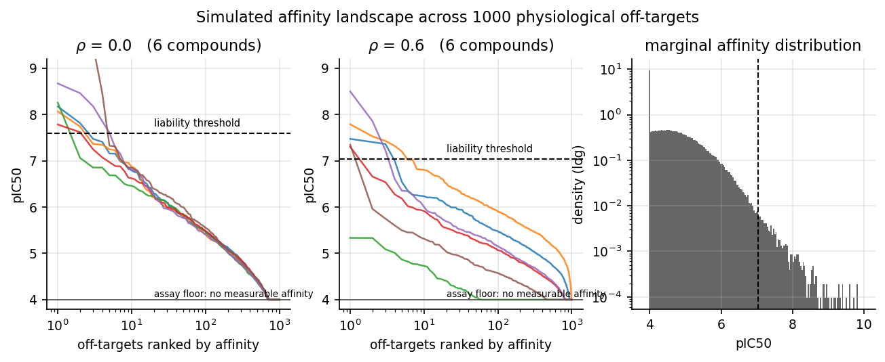
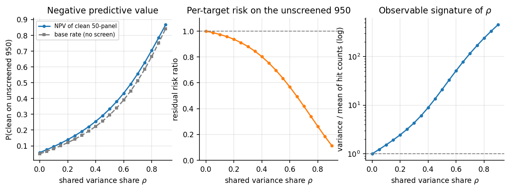
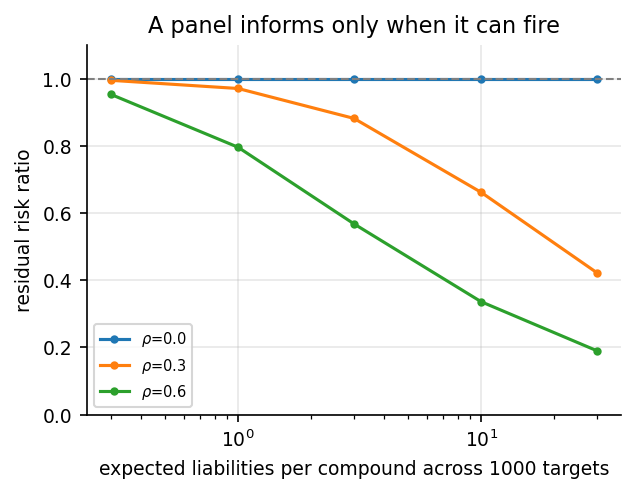
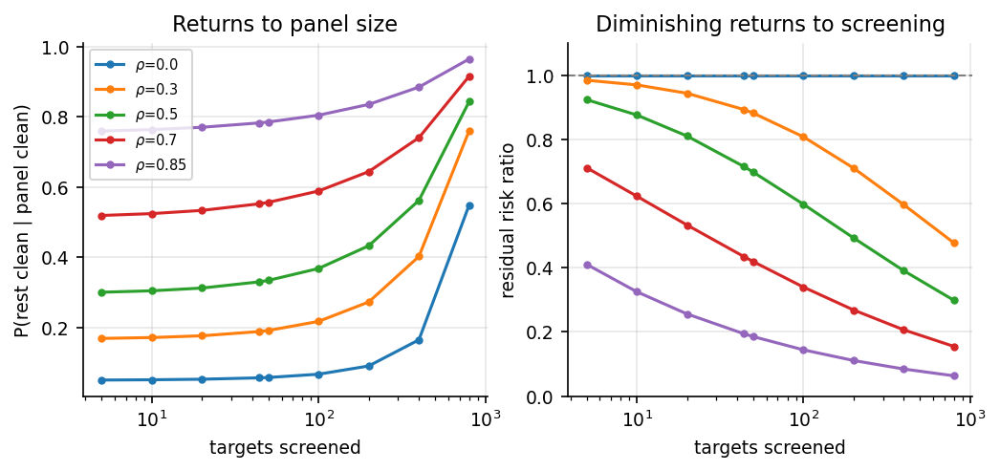
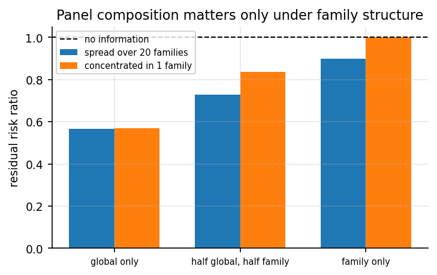
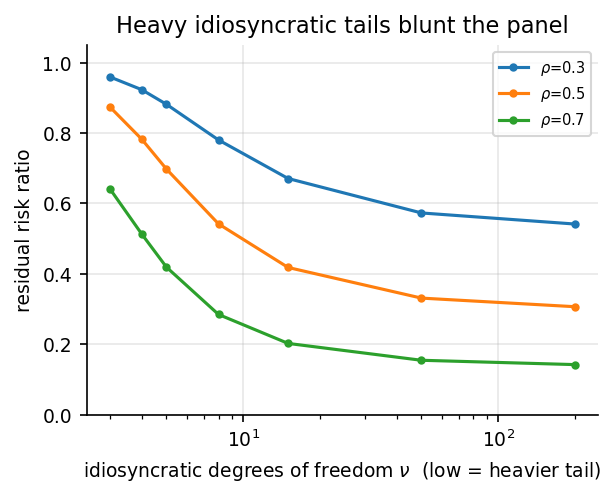
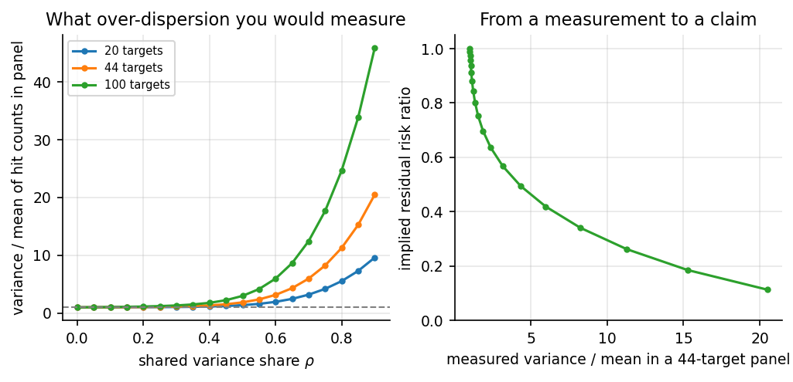

# What can a 50-target safety panel tell you about the other 950?

An illustrative simulation study of off-target screening under shared compound-level structure.

## 1. The question

Suppose there are on the order of 1000 physiological off-targets at which a small molecule
could acquire a safety liability. In vitro pharmacological profiling panels screen a few tens
of these; the panels described by Bowes et al. cover roughly 44 targets chosen for the
severity and frequency of the adverse effects they mediate [1]. A panel that comes back clean
is routinely treated as reassurance about the compound as a whole, not merely about the 44
proteins on the plate.

That inference needs a justification, and the justification cannot be statistical independence.
If affinities at different targets were independent across compounds, then learning that a
compound is inactive at 50 of them would carry exactly no information about the remaining 950.
The panel would license a claim about the panel and nothing else. Since the industry does draw
the broader inference, the working assumption must be that affinities covary across targets:
some compounds are dirty nearly everywhere and some are clean nearly everywhere.

This study makes that argument quantitative. We ask how strong the shared structure has to be
before a small panel supports a claim about the unscreened proteome, how the answer depends on
panel size and on the weight of the affinity distribution's tail, and whether the required
amount of shared structure can be estimated from data that screening groups already hold.

## 2. Model

We work with a latent affinity for compound *c* at target *t*, on a standardised scale that we
map to pIC50 only for plotting:

```
z_ct = sqrt(rho_g) * phi_c  +  sqrt(rho_f) * psi_{c,f(t)}  +  sqrt(1 - rho_g - rho_f) * eps_ct
```

In words: every compound has a promiscuity score `phi_c`, drawn from a standard normal, that
raises or lowers its affinity at all targets together; it may also have family-specific
promiscuity scores `psi_{c,f}` that act only within one target family, such as the aminergic
GPCRs or a kinase branch; and each compound-target pair has its own idiosyncratic deviation
`eps_ct`. We draw `eps_ct` from a Student-t distribution rescaled to unit variance, which gives
the long right tail the problem calls for: most pairs sit far below any threshold of concern,
a small minority are extreme. A compound has a liability at target *t* when `z_ct` exceeds a
threshold `theta`, which we read as an affinity high enough to matter at clinical exposure.

The variance shares `rho_g` and `rho_f` are the parameters of interest. Because the three terms
are independent and each is standardised, `rho_g` is both the fraction of affinity variance
attributable to compound-level promiscuity and the correlation between any two targets in
different families. We refer to it as `rho` where there is no family structure.

Two ways of framing the problem turn out to be the same object. One can say that target
affinities covary, or one can say that the whole affinity distribution sits higher for some
compounds than others. For a single shared factor these are algebraically identical statements:
`phi_c` is simultaneously the source of the correlation and the compound-level shift. The
choice that carries real modelling content is not which of the two phrasings to adopt, but how
many shared factors there are and how heavy the idiosyncratic tail is. Sections 7 and 8 show
that these two choices drive different conclusions about panel design.



*Figure 0. Sorted affinity profiles for six compounds across 1000 off-targets, and the marginal
affinity distribution. On the left, with no shared structure, the six profiles lie on top of one
another: compounds are interchangeable, and knowing one compound's affinity at one target tells
you nothing about its affinity elsewhere. In the middle, with 60% of variance shared, the
profiles separate into visibly dirty and visibly clean compounds. On the right, the marginal
distribution with the assay floor at pIC50 4 and the liability threshold in the upper tail.*

We fix the threshold so that the marginal probability of a liability is 0.003 per compound per
target, giving three expected liabilities per compound across 1000 targets and a 4.96% chance
that a compound is clean at every one. Section 6 varies this rate; the qualitative conclusions
do not depend on it, though the magnitudes do.

## 3. What we measure

The natural summary is the negative predictive value: the probability that a compound with a
clean panel is clean everywhere else. That quantity is awkward here because it moves with the
base rate of clean compounds, which itself changes as we vary `rho`. We therefore lead with a
normalised quantity, the **residual risk ratio**:

```
R(n) = E[ per-target liability rate on the unscreened targets | panel of size n is clean ]
       ------------------------------------------------------------------------------
                       unconditional per-target liability rate
```

`R = 1` means the clean panel has told you nothing; `R = 0.4` means it has cut the expected
liability rate across the rest of the proteome by 60%. Under independence `R(n) = 1` exactly,
for every panel size, and our implementation reproduces this to within 1e-9 as an analytic
identity rather than a numerical coincidence.

With no family structure the targets are exchangeable, so every quantity we need is a
one-dimensional integral over `phi` and we compute it by quadrature rather than simulating.
We verified the quadrature against Monte Carlo with 200,000 compounds at three values of `rho`;
negative predictive values agree to within 0.003 and residual risk ratios to within 0.008
(`results/exp5_mc_check.csv`). The Monte Carlo path is used where it is needed, in the
family-structured case of Section 7.

## 4. Under independence a clean panel is worth nothing

With `rho = 0`, a compound that is clean on 50 targets has an expected 2.85 liabilities among
the remaining 950, which is exactly 950 times the unconditional rate. The negative predictive
value is 5.76% against a base rate of 4.96%, and the entire difference comes from there being
50 fewer targets left to go wrong, not from anything learned about the compound.

This is worth stating plainly because it sets the terms of the rest of the study. The 44-target
panel is not defensible as a proteome-wide claim on the basis of coverage; 44 out of 1000 is
4.4% of the targets and, absent shared structure, 4.4% of the information. Whatever value the
panel has as a general safety signal has to come from covariance.

## 5. How much covariance buys



*Figure 1. Left: negative predictive value of a clean 50-target panel against the base rate of
clean compounds. Centre: residual risk ratio, which is 1 by construction under independence.
Right: over-dispersion of hit counts across 1000 targets, plotted on a log scale.*

| `rho` | P(clean everywhere) | NPV of clean 50-panel | Residual risk ratio |
|---|---|---|---|
| 0.0 | 0.050 | 0.058 | 1.000 |
| 0.3 | 0.166 | 0.192 | 0.881 |
| 0.5 | 0.296 | 0.334 | 0.697 |
| 0.6 | 0.390 | 0.433 | 0.567 |
| 0.7 | 0.513 | 0.557 | 0.419 |
| 0.85 | 0.752 | 0.785 | 0.185 |

The relationship is smooth and, we would argue, sobering. Half the affinity variance has to be
shared before a clean 50-target panel cuts the expected liability rate elsewhere by even 30%.
To reach a two-thirds reduction requires `rho` above 0.8, meaning that four fifths of all
variation in binding affinity across the proteome is a single compound-level property. That is
a strong claim about pharmacology, and Section 9 discusses what would have to be true for it
to hold.

The negative predictive value column illustrates why we do not lead with it. At `rho = 0.85`
the panel appears to deliver a 78.5% chance that the compound is clean everywhere, which sounds
like a strong result; but 75.2% of compounds are clean everywhere in that setting regardless of
whether anyone screens them. Most of the apparent performance is base rate.

## 6. The panel has to be able to fire



*Figure 1b. Residual risk ratio against the number of liabilities a compound carries on average.*

A test that almost nothing fails carries almost no information, whatever the correlation
structure. At our baseline rate a 50-target panel is clean for 86% of compounds, and a result
that common cannot update beliefs much. Holding `rho` at 0.6 and varying the underlying
liability rate: when compounds average 0.3 liabilities across the proteome the residual risk
ratio is 0.95, and when they average 30 it is 0.19.

This has a practical reading. The informativeness of a panel depends on the concentration at
which it is run and on how liberally a hit is called, and not only on which targets it contains.
A panel calibrated so that a typical compound trips one or two flags is doing more inferential
work than a panel calibrated so that nearly everything passes, even though the latter looks
more reassuring.

## 7. Returns to panel size, and to panel composition



*Figure 2. Negative predictive value and residual risk ratio against the number of targets
screened.*

Returns to panel size are roughly logarithmic. At `rho = 0.7`, screening 5 targets gives a
residual risk ratio of 0.71, 50 targets gives 0.42, 200 gives 0.27 and 800 gives 0.15. The
reason is that a panel under a single global factor is a measurement of one scalar, `phi_c`,
and the precision of that measurement improves with the square root of the number of
observations at best. Going from 44 targets to 200 is a fourfold increase in assay cost for
roughly a further third off the residual risk.

Composition is a different matter, and here the number of shared factors decides everything.



*Figure 4. Residual risk ratio for two 50-target panel designs under three correlation
structures, from Monte Carlo with 200,000 compounds and 20 target families.*

| Structure | Panel spread over 20 families | Panel concentrated in 1 family |
|---|---|---|
| Global only (`rho_g` = 0.6) | 0.567 | 0.569 |
| Half global, half family (0.3, 0.3) | 0.729 | 0.837 |
| Family only (`rho_f` = 0.6) | 0.898 | 1.002 |

Under a single global promiscuity axis the two designs are statistically indistinguishable, as
they must be, since the targets are exchangeable and any 50 of them estimate `phi_c` equally
well. Under family-only structure the concentrated panel has a residual risk ratio of 1.00: it
measures one family's promiscuity perfectly and says nothing whatsoever about the other 19. The
same 50 assays, spread across families, achieve 0.90.

The practical implication is that the case for a carefully curated panel and the case for a
large panel rest on different premises. If promiscuity is one global property, panel
composition barely matters for proteome-wide inference and the only lever is size. If
promiscuity is family-structured, composition is the whole game and coverage of families
matters more than the count of targets. Panels in current use are curated on a third basis
entirely, the clinical severity of the effect each target mediates [1], which is a good reason
to screen a target directly but is not a reason to expect it to be informative about anything
else.

## 8. Heavy tails blunt the panel



*Figure 3. Residual risk ratio against the degrees of freedom of the idiosyncratic term. Low
degrees of freedom mean a heavier tail.*

At fixed `rho`, how much a clean panel buys depends on where the liabilities come from. If the
idiosyncratic term is close to Gaussian, threshold exceedances are driven mainly by the shared
factor and a panel that pins down `phi_c` pins down most of the risk. If the idiosyncratic term
is heavy-tailed, exceedances are dominated by one-off structural coincidences between a
particular compound and a particular binding site, and no amount of screening elsewhere
anticipates them. At `rho = 0.5` the residual risk ratio moves from 0.31 with a near-Gaussian
idiosyncratic term to 0.87 with three degrees of freedom.

This matters because the heavy-tailed case is the one that matches the phenomenon the panels
exist to catch. Idiosyncratic, structurally specific, high-affinity interactions are precisely
the events that end development programmes. The variance share `rho` and the tail index are
therefore both needed; a correlation estimate alone does not determine how much a clean panel
is worth.

## 9. Estimating the shared structure from panels already run



*Figure 5. Left: over-dispersion of per-compound hit counts as a function of `rho`, for three
panel sizes. Right: mapping a measured over-dispersion in a 44-target panel to the implied
residual risk ratio.*

None of the above is useful unless `rho` can be measured, and it can, from data that profiling
groups already have. Shared compound-level structure over-disperses the per-compound hit count
relative to the binomial count expected under independence, and the ratio of variance to mean
in hit counts is a direct readout:

| `rho` | Variance/mean of hit counts in a 44-target panel | Implied residual risk ratio |
|---|---|---|
| 0.0 | 1.00 | 1.000 |
| 0.3 | 1.14 | 0.881 |
| 0.5 | 1.86 | 0.697 |
| 0.6 | 3.16 | 0.567 |
| 0.7 | 5.97 | 0.419 |
| 0.8 | 11.28 | 0.262 |

A worked example: a group holding hit counts for a few thousand compounds across a 44-target
panel computes a variance-to-mean ratio of 3.2. Read against this model, that indicates roughly
60% of affinity variance is shared, which in turn indicates that a clean panel cuts the expected
liability rate across unscreened targets by a little over 40%. That is a defensible claim and a
useful one. It is a substantially weaker claim than "the compound is clean".

We note two cautions on this estimator. Over-dispersion also arises from target-level variation
in base rates, since some targets are promiscuity magnets that many compounds hit; that
mechanism inflates the variance-to-mean ratio without implying any compound-level covariance,
and it must be removed by conditioning on target before the remaining over-dispersion is read
as `rho`. Assay batch effects do the same thing. Estimating `rho` properly means fitting the
factor model, not reading the ratio off raw counts; the table above is a diagnostic for whether
the exercise is worth doing.

## 10. Suggestions on how to set this up

The user question that motivated this study was whether to represent the phenomenon as
covariance between targets or as a compound-level shift in the affinity distribution. Our
answer is that for one factor these are the same model, so the question to settle instead is
the following, and we would settle it in this order.

First, how many shared factors, and are they nested? A single global axis and a
family-structured set of axes give the same marginal correlations at the right parameter values
but opposite advice on panel design, as Section 7 shows. This is the choice that changes
decisions.

Second, how heavy is the idiosyncratic tail? Section 8 shows this matters as much as `rho`
itself, and it is the parameter most likely to be misspecified, because a Gaussian residual is
the default and is the optimistic case.

Third, if the marginal affinity distributions per target need to match real data, we would
separate the marginals from the dependence and use a Gaussian factor copula: keep the factor
structure on a latent normal scale, then transform each target's latent value through its own
empirical affinity distribution. This preserves the interpretation of `rho` while letting hERG
and a peripheral kinase have entirely different hit rates and tail shapes. We did not need this
for the illustrative case here, where all targets are exchangeable, but it is the version we
would fit to data.

Fourth, we would treat `phi_c` as partly predictable rather than latent. Lipophilicity and
basicity are associated with promiscuity across the proteome [2], which means a prior on `phi_c`
is available before any screening. In the framework here, prior information on `phi_c` is
interchangeable with additional panel targets, and quantifying that exchange rate would be a
direct extension of this work: it would say how many assays a physicochemical prediction is
worth.

Finally, a distinction that is easy to lose. Target-level variation in base rates, where some
targets are hit by many compounds, is a third mechanism entirely. It raises the yield of a panel
and justifies including promiscuous, high-consequence targets, but on its own it supports no
inference from screened to unscreened targets. Only compound-level structure does that.

## 11. Limitations

The model treats the liability threshold as fixed and known. In practice the threshold is a
margin over clinical exposure, so it varies by compound and by target, and a compound with a
low efficacious dose tolerates affinities that would be disqualifying in another programme. We
expect this to add variance that behaves like a further compound-level factor, which would
inflate an empirical estimate of `rho` obtained without accounting for it.

We treat all 1000 targets as equally consequential. They are not: a liability at hERG and a
liability at an orphan receptor differ by orders of magnitude in expected cost. A
severity-weighted version of the residual risk ratio would be more decision-relevant, and we
have not built one.

Our figure of 1000 physiological off-targets, the marginal liability rate of 0.003 and the
choice of five degrees of freedom for the idiosyncratic term are illustrative rather than
estimated. Nothing here is calibrated to a real profiling dataset, and the numerical values in
the tables should be read as showing the shape of the relationships, not as estimates. The one
result that does not depend on any of these choices is that the residual risk ratio equals 1
under independence, which follows from the structure of the model rather than its parameters.

We assume the compound being screened is exchangeable with the compounds from which `rho` would
be estimated. Within a lead series that assumption fails in a specific direction: analogues
share scaffold-driven off-target profiles, so a series-specific factor sits between the global
factor and the idiosyncratic term. This would make within-series panel inference stronger than
this model suggests and cross-series inference weaker.

We also do not model false negatives in the panel itself. A clean panel result includes assay
failures and compounds tested below their effective concentration, and both push the residual
risk ratio back toward 1.

## 12. Reproducing

```
pip install -r requirements.txt
python run_all.py          # writes results/*.csv and figures/*.png, a few minutes
python -m pytest tests -q  # 7 checks, including the independence identity
```

`offtarget_panel/model.py` holds the generative model, the threshold calibration, the
quadrature results and the Monte Carlo sampler. `run_all.py` holds the experiments. All
randomness is seeded, so the numbers in this report reproduce exactly.

## References

[1] Bowes J, Brown AJ, Hamon J, Jarolimek W, Sridhar A, Waldron G, Whitebread S. Reducing
safety-related drug attrition: the use of in vitro pharmacological profiling. *Nature Reviews
Drug Discovery* 11(12):909-922, 2012. [doi:10.1038/nrd3845](https://doi.org/10.1038/nrd3845)

[2] Leeson PD, Springthorpe B. The influence of drug-like concepts on decision-making in
medicinal chemistry. *Nature Reviews Drug Discovery* 6(11):881-890, 2007.
[doi:10.1038/nrd2445](https://doi.org/10.1038/nrd2445)
